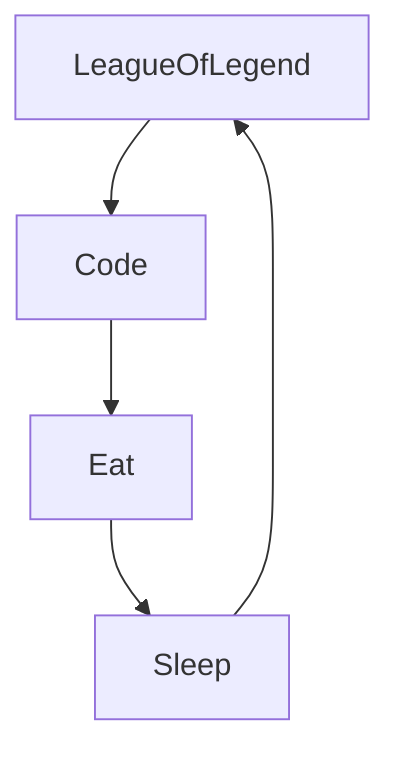

# 🐰  Howdy!
🇫🇷

## 💻 Welcome to the Clown Fiesta:
### Currently riding the Go rollercoasters, navigating the wild, untamed jungles of DevOps and Cloud. 🤡
#### 🕵️‍♂️ I could be a nocturnal vampire 🧛, a wise owl 🦉, or maybe a blend of both for midnight snacks. 🌑 (Sunlight and garlic? Nah, not my style.)

# See you later alligator 🐊
<!---
Yalcael/Yalcael is a ✨ special ✨ repository because its `README.md` (this file) appears on your GitHub profile.
You can click the Preview link to take a look at your changes.
--->
